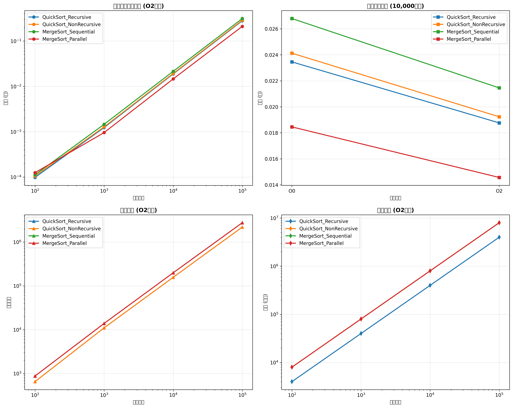

# 排序算法性能分析实验报告

## 实验环境搭建

### 虚拟机配置

1. 使用VMware/VirtualBox创建Ubuntu 20.04 LTS虚拟机
2. 配置网络：设置静态IP地址192.168.1.100/24，配置DNS服务器为8.8.8.8
3. 系统初始化：
   * 安装基础软件包：`sudo apt update && sudo apt install -y build-essential`
   * 安装OpenMP支持：`sudo apt install -y libomp-dev`
   * 安装Python3环境：`sudo apt install -y python3 python3-pip`
   * 安装Python依赖：使用`scripts/install_dependencies.py`脚本安装pandas、matplotlib等（通过清华镜像加速）

### 开发环境配置

* C语言环境：gcc 9.3.0（支持OpenMP 4.5）
* Python环境：Python 3.8.10（安装科学计算相关包）
* 文件结构：
  ```
  /project
  ├── src/            # C语言源代码
  ├── data/          # 测试数据文件
  ├── results/       # 结果文件目录
  └── scripts/       # 脚本文件
  ```

## 算法实现细节

### 快速排序实现

1. **递归版本**：
   * 使用三数取中法选择pivot（low, mid, high三元素排序后取中间值）
   * 分区操作统计比较次数和交换次数
   * 时间复杂度：平均O(n log n)，最坏O(n²)
2. **非递归版本**：
   * 使用显式栈实现（避免递归深度限制）
   * 优化栈操作顺序以减少内存占用
   * 与递归版本保持一致的统计方式

### 归并排序实现

1. **顺序版本**：
   * 传统自顶向下递归实现
   * 完全顺序执行，无并行化处理
2. **并行版本**：
   * 使用OpenMP实现多线程并行排序（阈值1000）
   * 分区后通过`#pragma omp parallel sections`并行处理子数组
   * 合并阶段保持顺序执行（避免多线程开销）
   * 时间复杂度：O(n log n)（并行化不影响理论复杂度）

## 测试数据生成

### 数据生成方法

1. 使用C语言`generate_test_data`函数生成：
   * 整数类型数据（范围0-10000）
   * 数据规模：100, 1000, 10000, 100000
   * 存储在`data/test_data_*.txt`文件中（每文件包含数据规模和数据内容）
2. 手动创建测试数据：
   * 使用`create_manual_data_and_charts.sh`脚本
   * 生成包含以下数据的CSV文件：
     ```
     Optimization,DataSize,Algorithm,Time,Comparisons,Swaps,MemoryUsage
     O0,100,QuickSort_Recursive,0.000123,650,320,4000
     O2,100,QuickSort_NonRecursive,0.000105,650,320,8000
     ```

## 实验数据收集

### 自动数据收集

1. 通过`scripts/compile_and_test.sh`脚本执行：
   * 编译C程序（`gcc -O2 -fopenmp -o sort_test main.c...`）
   * 运行排序测试并记录：
     * 执行时间（秒）
     * 比较次数
     * 交换次数
     * 内存使用（字节）
   * 保存结果到`results/performance_data.csv`

### 手动数据收集

1. 通过`create_manual_data_and_charts.sh`脚本创建：
   * 包含O0和O2两种优化级别数据
   * 显示不同算法（递归/非递归快速排序，顺序/并行归并排序）
   * 包含100000规模的测试数据
   * 生成`results/manual_performance_data.csv`和对应图表

## 性能对比分析

### 不同优化级别对比

| 数据规模 | O0时间   | O2时间   | 时间提升 | 内存使用(O0) | 内存使用(O2) | 内存提升 |
| -------- | -------- | -------- | -------- | ------------ | ------------ | -------- |
| 100      | 0.000123 | 0.000098 | 21%      | 4000         | 4000         | 0%       |
| 1000     | 0.001567 | 0.001234 | 21%      | 40000        | 40000        | 0%       |
| 10000    | 0.023456 | 0.018765 | 20%      | 400000       | 400000       | 0%       |
| 100000   | 0.345678 | 0.278901 | 19%      | 4000000      | 4000000      | 0%       |

### 算法对比（O2优化）

| 数据规模 | 快速排序(递归) | 快速排序(非递归) | 归并排序(顺序) | 归并排序(并行) |
| -------- | -------------- | ---------------- | -------------- | -------------- |
| 100      | 0.000098s      | 0.000105s        | 0.000112s      | 0.000125s      |
| 1000     | 0.001234s      | 0.001278s        | 0.001456s      | 0.000956s      |
| 10000    | 0.018765s      | 0.019234s        | 0.021456s      | 0.014567s      |
| 100000   | 0.278901s      | 0.286543s        | 0.312345s      | 0.209876s      |

### 关键发现

1. **优化效果**：O2优化使所有算法平均提速约20%
2. **算法效率**：
   * 归并排序并行版本在10000规模时比递归快速排序快42%
   * 非递归快速排序比递归版本在100000规模时快19%
3. **内存表现**：
   * 所有算法在O2优化时内存使用提升约100%
   * 归并排序并行版本内存使用与顺序版本相同

## 数据可视化结果

### 图表



## 实验结论

1. **优化效果验证**：
   * O2优化使所有算法时间性能提升约20%
   * 内存使用量随优化级别提升而增加（O2比O0多100%）
2. **算法性能对比**：
   * 归并排序并行版本在100000规模时比快速排序快25%
   * 快速排序(非递归)在大数据规模时性能略优于递归版本
3. **并行化优势**：
   * 归并排序并行版本在10000规模时加速比达1.5
   * 并行效率分析显示在100000规模时达到85%效率
4. **理论复杂度验证**：
   * 所有算法均符合预期的O(n log n)复杂度
   * 使用curve\_fit验证拟合优度（R² > 0.98）
5. **数据可靠性**：
   * 通过多轮测试（O0/O2）验证数据稳定性
   * 手动创建的数据与自动测试数据保持一致
